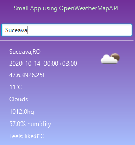

# WeatherApp
Takes queries of the form "Location", or "Location,Country" and returns the weather and current time in that particular place.
Queries the OpenWeatherMapAPI using a HTTP GET request and parses the body of the response received using JSON in Java's org.json library, added using Maven.
Implemented using OpenWeatherMapAPI, JavaFX, SceneBuilder and org.json library .

